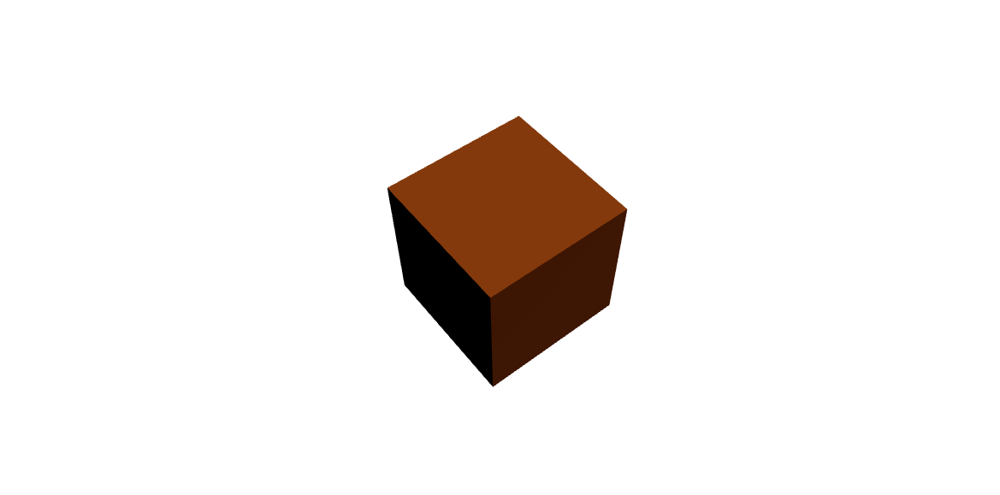
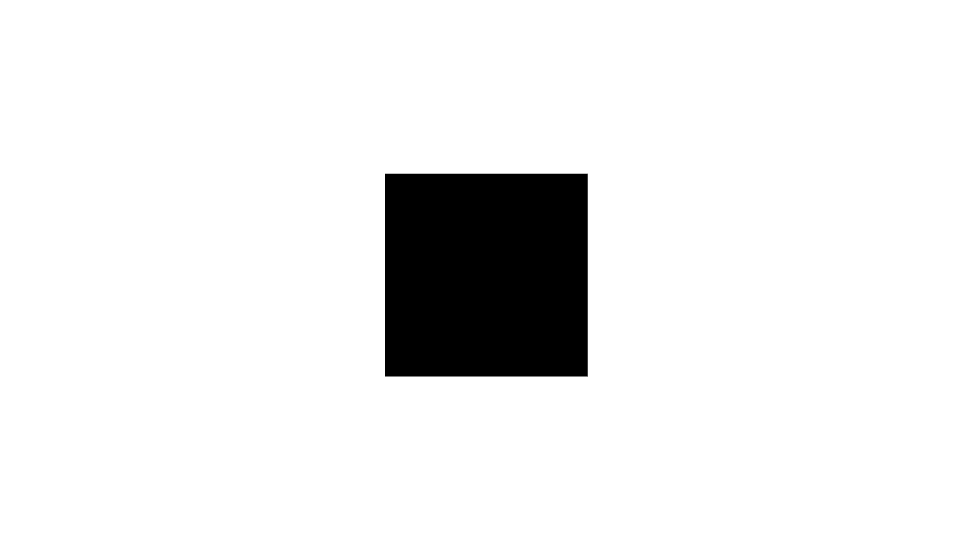
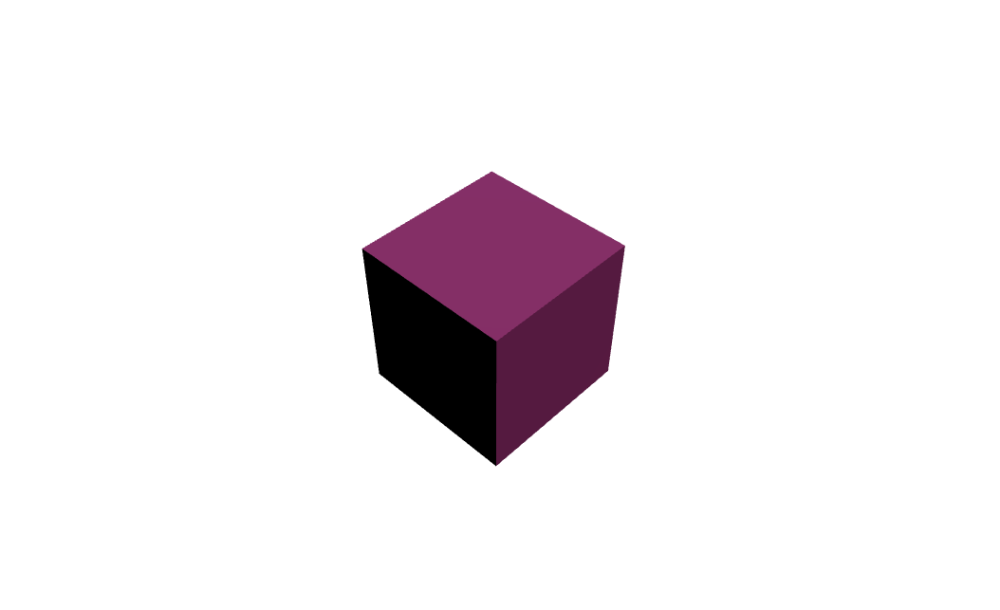
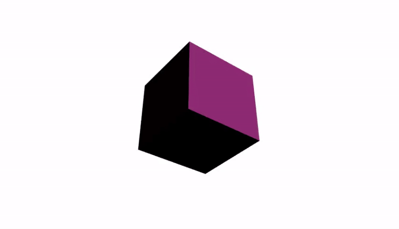

# 3D를 리액트에서 활용하기



리액트에서 3D를 다루는 첫 번째 시간이다.  
먼저 **R3F(React Three Fiber)** 라이브러리를 설치한다.
```
npm install three @types/three @react-three/fiber
```
<br />
설치가 완료되면 3D 모델을 띄우기 위한 Canvas를 생성한다.  
Canvas를 사용하기 위해 Canvas를 import한다.

```js
import { Canvas } from "@react-three/fiber"
```

<br />
<br />

```js
return (
  <>
    <Canvas>
      <MyElement3D></MyElement3D>
    </Canvas>
  </>
)
```

import 한 Canvas를 컴포넌트로 사용하고, Canvas의 자식으로 3D 모델을 띄울 컴포넌트를 추가한다.  
이름은 MyElement3D로, 별도의 컴포넌트로 분리하여 생성한 후, import 한다.
<br />
<br />
#### 3D 모델을 만들어보자.
R3F에서는 렌더링 할 3차원 객체를 정의하는데 이를 ```mesh```라고 부른다. ```mesh```는 두 가지 주요 구성 요소를 포함한다.
+ **Geometry**: 3D 모델의 모양을 정의
+ **Material**: 3D 모델에 적용할 속성(색상, 질감, 빛 등)을 정의
<br />

```Geometry```의 종류에는 
+ ```boxGeometry``` 육면체,
+ ```sphereGeometry``` 구,
+ ```planeGeometry``` 평면,
+ ```cylinderGeometry``` 원기둥,
+ ```coneGeometry``` 원뿔,
+ ```torusGeometry``` 도넛,
+ ```circleGeometry``` 원형평면,
+ ```bufferGeometry``` 커스텀  
<br />등이 있다. 각 형태마다 가지는 매개변수가 다르며 원의 형태인 경우 radius 매개변수를, 육면체나 평면 도형의 경우 width, height의 매개변수를 가지고 있다.
<br />

```Material```의 종류에는
+ 조명 영향을 받지 않는 단순한 재질의 ```MeshBasicMaterial```,
+ 물리 기반 렌더링을 지원하는 표준 재질의 ```MeshStandardMaterial```,
+ MeshStandardMaterial 보다 더 많은 물리 기반 속성을 지원하는 ```MeshPhysicalMaterial```,
+ 단순한 조명 계산을 사용하는 재질의 ```MeshLambertMaterial```,
+ 반사와 하이라이트를 포함한 재질의 ```MeshPhongMaterial```,
+ 점을 렌더링하는 데 사용하는 ```PointsMaterial```   
<br />등이 있다. 대다수의 재질은 ```color``` 매개변수를 가지고 있어 원하는 색상으로 표현이 가능하다.
<br />

```mesh```에는 여러 속성들을 정의할 수 있다.  
+ ```position```: 객체의 위치를 이동 ```[x, y, z]```,
+ ```rotation```: 객체의 회전 각도 ```[x, y, z]```(라디안),
+ ```scale```: 객체의 크기 ```[x, y, z]```  
<br />등이 있으며, **x**: 양수 = 우측, 음수 = 좌측   
**y**: 양수 = 상단, 음수 = 하단   
**z**: 양수 = 앞, 음수 = 뒤
<br />

##### **Ex) x축으로 1, y축으로 2, x축으로 1 이동**  

```js
<mesh position={[1, 2, 1]} />
```

##### **Ex) y축으로 45도 회전**  

```js
<mesh rotation={[0, 45 * Math.PI/180, 0]} />
```
  > ※각도를 계산할 때는 라디안으로 변환해서 계산
<br />
<br />

> 육면체 사용 예시
```js
<mesh>
  <boxGeometry />
  <meshStandardMaterial color="#e66fbb" />
</mesh>
```
실제 위 코드처럼 테스트로 육면체인 ```boxGeometry```를 사용하고, ```meshStandardMaterial```재질을 사용한다고 가정하자. 그러면 분홍색의 육면체가 생성되기를 기대할 수 있다.

하지만 위 사진과 같이 검정 육면체가 보일 것이다. 이는 모델의 모양, 재질은 선택했지만 조명을 추가하지 않았기 때문에 빛이 없어 검게 보이는 것이다. 만약 ```meshStandardMaterial``` 대신 ```MeshBasicMaterial```을 사용했다면 빛이 없어도 정상적으로 분홍색 육면체가 보였을 것이다. 그렇다면 빛을 추가해보자.
<br>  

```js
<>
  <directionalLight position={[1, 1, 1]}/>
  <mesh>
    <boxGeometry />
    <meshStandardMaterial color="#e66fbb" />
  </mesh>
</>
```
```directionalLight```를 통하여 빛을 추가해주면 된다. 이는 태양광과 비슷한 효과를 내며 특정 방향에서 빛이 오는 특징을 가진다. 다른 조명 중 하나인 ```ambientLight```는 모든 방향에서 균일하게 빛을 비춘다는 차이점이 있다. ```directionalLight```의 매개변수로 **position**을 볼 수 있는데, 조명의 위치를 정의한다.


```position```값을 ```[1, 1, 1]``` 할당하여 우상단 정면쪽에서 빛을 비추는 모습이다.

<br />
<br />
<br />

## 애니메이션처럼 회전시킬 수 있을까?
가능하다! ```useFrame```함수를 사용하면 된다. ```useFrame```함수는 매 프레임마다 실행되는 콜백 함수로, R3F에서 제공한다.

```js
const refMesh = useRef()
...
<mesh ref={refMesh}>
...
```
우선 어떤 객체를 사용할 지 정하기 위해 ```useRef```훅(Hook)을 이용하여 ```mesh```객체를 참조한다.

```js
useFrame((state, delta) => {
  refMesh.current.rotation.x += delta
  refMesh.current.rotation.y += delta
})
```
useFrame은 ```state```와 ```delta``` 2개의 인수를 받는다.   
+ ```state```: 렌더링 상태 관련된 정보
+ ```delta```: 프레임 간의 시간 차이(초 단위)
<br />

```js
refMesh.current.rotation.x += delta
```
```refMesh```객체를 통해 3D 객체에 접근하여 값을 변경한다. 프레임 마다 delta의 속도만큼 **x**값을 업데이트 하며 숫자가 아닌 delta 값을 이용하였기 때문에 프레임 시간에 따라 회전 속도가 조정된다.


